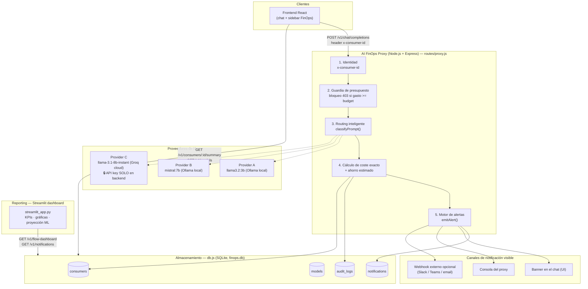

# Arquitectura — AI FinOps Proxy (Mercedes-Benz Hackathon)

## Principio de diseño

Separación estricta de responsabilidades en **3 capas independientes**:

1. **Proxy (Node.js/Express)** — única puerta de entrada a los modelos de IA. Aplica identidad, presupuesto, routing y coste. Nunca expone claves de API.
2. **Almacenamiento (SQLite)** — única fuente de verdad para consumidores, catálogo de modelos, auditoría y notificaciones.
3. **Reporting (Streamlit)** — capa de solo lectura que consulta al proxy (nunca a la BD directamente) para pintar dashboards y proyecciones ML.

## Diagrama

## Flujo de una petición

1. El **frontend** envía `POST /v1/chat/completions` con el prompt y la cabecera `x-consumer-id` (nunca con claves de API).
2. El **proxy** valida identidad y presupuesto (`db.getConsumerById`). Si el gasto ya alcanzó el límite → **HTTP 403** + alerta `blocked` (bloqueo visible en la demo).
3. Si hay presupuesto, `classifyPrompt()` decide el modelo según longitud del prompt, palabras clave de razonamiento y estado del presupuesto (guardrail al 90%).
4. El proxy llama al proveedor elegido (`callProvider`) — real si `ENABLE_REAL_PROVIDERS=true`, simulado en caso contrario. **Las claves de proveedor (p. ej. `GROQ_API_KEY`) viven solo en variables de entorno del proceso Node y jamás se incluyen en la respuesta al cliente.**
5. Se calcula el coste exacto con las tarifas de la tabla `models`, y el **ahorro estimado** frente a haber usado siempre el modelo más caro (`mistral:7b`).
6. Se persiste todo en `audit_logs` (transaccional) y se actualiza `current_spend_usd` del consumidor.
7. Si el nuevo gasto cruza el 80%/90% de presupuesto, se emite una alerta (`emitAlert`): se guarda en `notifications`, se loguea en consola, se envía a un webhook externo si está configurado, y se devuelve en la respuesta HTTP para que el frontend la muestre como banner inmediato.
8. El **dashboard Streamlit** es un cliente más de la API (`/v1/flow-dashboard`, `/v1/notifications`): nunca toca `finops.db` directamente, preservando la separación de capas.

## Seguridad

- `GROQ_API_KEY` solo se lee vía `process.env` dentro de `routes/proxy.js` y se usa exclusivamente como cabecera `Authorization` en la llamada saliente `axios.post(...)`. No aparece en logs de request/response ni en el JSON devuelto al frontend.
- El frontend y el dashboard solo conocen URLs públicas del proxy (`VITE_API_URL` / `FINOPS_BACKEND_URL`), nunca credenciales de proveedores.
- El catálogo expuesto en `GET /v1/models` incluye tarifas y `base_url`, pero ningún secreto.
